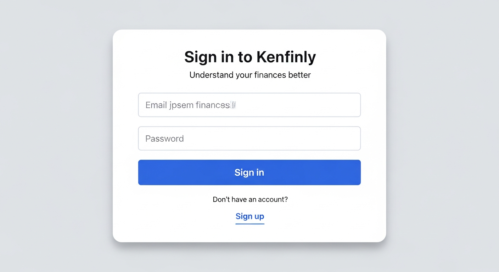
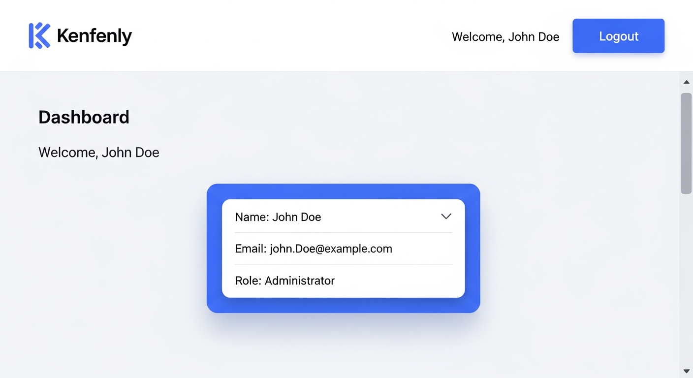

# Personal Finance Application (Kenfinly)

> **Understand your finances.**

Kenfinly is a personal finance application designed to help individuals **understand, track, and improve their financial health**.  
Our mission is to empower users with insights that make money management simple, transparent, and meaningful.

---

## 🚀 Planned Features

- 💰 Expense and income tracking with multi-account and multi-currency support 
- 📊 Advanced budget planning and detailed analytics dashboards  
- 🎯 Goal-oriented savings plans with progress tracking  
- 🔔 Smart notifications and personalized spending insights  
- ☁️ Secure cloud synchronization for data backup and multi-device access (planned for future release)

---

## 🧭 Vision

At Kenfinly, we believe financial clarity is the foundation of personal freedom.  
Our mission is to turn complex financial data into clear, actionable insights — helping users make smarter financial decisions every day.

---

## 🛠️ Technology Stack

- **Frontend:** React with TypeScript (currently implemented), potential exploration of Flutter or Next.js for cross-platform or server-side rendering  
- **Backend:** Laravel 12 (PHP REST API) currently powering the core backend, with Python scripts supporting data visualization. Future considerations include Node.js or FastAPI for microservices.  
- **Database:** MySQL or PostgreSQL, selected based on deployment needs and scalability  
- **CI/CD:** GitHub Actions for streamlined automated testing and deploy pipelines

> _Note: The technology stack will be finalized once the full architecture and project requirements are confirmed._

---

## 📦 Getting Started

This guide will help you deploy and use Kenfinly, whether you're setting it up locally for development or deploying to production.

### Deploying the Application

#### Local Development Setup

**Prerequisites:**
- PHP 8.1+
- Composer
- Node.js 16+ and npm
- SQLite (for local development) or MySQL/PostgreSQL

**Step-by-step instructions:**

1. **Clone the repository**
   ```bash
   git clone https://github.com/<your-org>/kenfinly.git
   cd kenfinly
   ```

2. **Install PHP dependencies**
   ```bash
   composer install
   ```

3. **Install Node.js dependencies**
   ```bash
   npm install
   ```

4. **Set up environment configuration**
   ```bash
   cp .env.example .env
   ```
   
   Edit the `.env` file and update the following:
   ```env
   APP_NAME=Kenfinly
   APP_URL=http://localhost:5000
   DB_CONNECTION=sqlite
   ```

5. **Generate application key**
   ```bash
   php artisan key:generate
   ```

6. **Generate JWT secret**
   ```bash
   php artisan jwt:secret
   ```

7. **Create and set up the database**
   ```bash
   touch database/database.sqlite
   php artisan migrate --seed
   ```
   
   This will create all necessary tables and seed default roles (owner, editor, viewer).

8. **Start the development servers**
   ```bash
   npm run serve
   ```
   
   This starts both the Laravel backend (port 5000) and Vite dev server (port 5173).

9. **Access the application**
   
   Open your browser and navigate to `http://localhost:5000`

#### Production Deployment

For production deployment, we recommend using a service like Replit, Heroku, or a VPS with the following configuration:

1. **Install dependencies**
   ```bash
   composer install --optimize-autoloader --no-dev
   npm install
   ```

2. **Generate application keys**
   ```bash
   php artisan key:generate
   php artisan jwt:secret
   ```
   
   **Important:** Save the generated `APP_KEY` and `JWT_SECRET` values to your environment variables.

3. **Environment Variables**
   
   Set these environment variables in your hosting platform:
   ```env
   APP_ENV=production
   APP_DEBUG=false
   APP_KEY=base64:your-generated-app-key
   APP_URL=https://your-domain.com
   DB_CONNECTION=mysql  # or pgsql
   DB_HOST=your-database-host
   DB_PORT=3306
   DB_DATABASE=kenfinly_production
   DB_USERNAME=your-db-username
   DB_PASSWORD=your-db-password
   JWT_SECRET=your-generated-jwt-secret
   ```

4. **Build frontend assets**
   ```bash
   npm run build
   ```

5. **Run migrations**
   ```bash
   php artisan migrate --force --seed
   ```

6. **Optimize application**
   ```bash
   php artisan config:cache
   php artisan route:cache
   php artisan view:cache
   ```

7. **Configure web server**
   
   Point your web server (Nginx/Apache) to the `public` directory and ensure all requests are routed through `public/index.php`.
   
   **Note:** The `npm run serve` command starts both the Laravel backend (port 5000) and Vite development server (port 5173) concurrently for local development only. In production, you should serve the built assets from the `public` directory.

### Registering an Account

Once the application is running, you can create a new account:

1. Click on the **"Sign up"** link or navigate to `/register`

2. Fill in the registration form with your details:
   - **Name:** Your full name
   - **Email:** A valid email address
   - **Password:** At least 8 characters
   - **Confirm Password:** Must match your password

3. Click the **"Sign up"** button


4. Upon successful registration, you'll be automatically logged in and redirected to the dashboard.

### Logging In

If you already have an account, you can log in:

1. Navigate to the login page at `/login`

2. Enter your credentials:
   - **Email:** The email you registered with
   - **Password:** Your account password

3. Click the **"Sign in"** button



4. After successful login, you'll be redirected to your dashboard where you can:
   - View your user information (name, email, role)
   - Access financial tracking features (coming soon)
   - Manage your account settings
   - Log out securely



**Security Notes:**
- Authentication tokens are stored securely in browser localStorage
- Unauthorized users attempting to access protected pages are automatically redirected to login
- All passwords are hashed using bcrypt before storage
- JWT tokens expire after 60 minutes and can be refreshed

---

## Prerequisites
Before proceeding, ensure your environment meets the following requirements:

### Software & Tools

| Component             | Supported Versions / Recommendations                                |
|-----------------------|---------------------------------------------------------------------|
| PHP                   | 8.1+                                                                |
| Composer              | Latest stable release                                                |
| Node.js & npm         | Node.js 16+ and npm (or yarn) latest stable                         |
| MySQL or PostgreSQL   | MySQL 8+ or PostgreSQL 13+                                           |
| Python                | 3.9+ with pip                                                        |
| Python Libraries      | seaborn, matplotlib, pandas (install via pip)                       |
| Git                   | For source control and cloning repository                           |
| Laravel 12            | Backend framework (via Composer)                                    |
| React with TypeScript  | Frontend framework                                                  |

### Environment

- Linux, macOS, or Windows (Windows users recommended WSL2 or similar Linux environment for best compatibility)
- Recommended 8GB+ RAM and stable internet connection for package installations

---

## Backend Setup (Laravel API)

### 1. Clone the Repository

```bash
git clone <repository-url>
cd personal-finance-app-backend
```

### 2. Install Dependencies

```bash
composer install
```

### 3. Environment Configuration

Rename `.env.example` to `.env`:

```bash
cp .env.example .env
```

Edit `.env` according to your environment. Key settings include:

- Database credentials

```env
DB_CONNECTION=mysql
DB_HOST=127.0.0.1
DB_PORT=3306
DB_DATABASE=personal_finance_db
DB_USERNAME=your_db_user
DB_PASSWORD=your_db_password
```

- JWT secret key (generate if missing)

```bash
php artisan jwt:secret
```

This generates your `JWT_SECRET` in `.env` needed for token authentication.

- Mail settings (optional, for password reset emails)

```env
MAIL_MAILER=smtp
MAIL_HOST=smtp.mailtrap.io
MAIL_PORT=2525
MAIL_USERNAME=null
MAIL_PASSWORD=null
MAIL_ENCRYPTION=null
MAIL_FROM_ADDRESS="no-reply@yourdomain.com"
MAIL_FROM_NAME="${APP_NAME}"
```

### 4. Database Setup & Migration

Create the database manually or via CLI. Then run migrations and seeders:

```bash
php artisan migrate --seed
```

This sets up all tables including users, accounts, transactions, participants, invitations, budgets, and others.

### 5. Running the Development Server

```bash
php artisan serve
```

By default, the API will be available at `http://localhost:8000`.

### 6. CSV Import & Data Handling

The backend provides a CSV import endpoint that accepts well-structured transaction files; you can test uploads once the frontend or API client is connected.

### 7. API Authentication

The backend uses JWT authentication for stateless session management:

- Register: `/api/auth/register`
- Login: `/api/auth/login`
- Password Reset (optional): via Email endpoint `/api/auth/password/reset`

Protected routes require a valid Bearer JWT token.

---

## Frontend Setup (React + TypeScript)

### 1. Navigate to Frontend Directory

```bash
cd ../personal-finance-app-frontend
```

### 2. Install Dependencies

```bash
npm install
# or yarn install
```

### 3. Environment Variables

Create `.env.local` in the frontend folder with API URL and other configs:

```env
REACT_APP_API_BASE_URL=http://localhost:8000/api
```

### 4. Running the Development Server

```bash
npm start
# or yarn start
```

Visit `http://localhost:3000` in your browser.

The frontend offers:

- Transaction entry and list management
- CSV bulk upload UI
- Dynamic dashboards showing financial charts
- User authentication UI (login/register)
- Participant invitation & role management interface

JWT tokens are securely stored via HttpOnly cookies or secure storage options by default.

---

## Python Visualization Setup (Seaborn)

The application visualizes financial insights via Python scripts using Seaborn and Matplotlib libraries.

### 1. Set Up Python Environment

If using virtual environments:

```bash
python3 -m venv venv
source venv/bin/activate  # macOS/Linux
.\venv\Scripts\activate   # Windows
```

### 2. Install Dependencies

```bash
pip install seaborn matplotlib pandas
```

### 3. Running Visualization Scripts

The backend triggers these scripts either via CLI or HTTP microservice calls.

- To manually run visualization generation:

```bash
python3 generate_charts.py --input transactions.json --output charts/
```

(Note: Script and input/output paths will vary based on your integration.)

The generated charts are served by the backend as static images and integrated into the React dashboard.

---

## Authentication Configuration

The app uses JWT for security via Laravel Sanctum or tymon/jwt-auth package.

- Ensure `JWT_SECRET` is set (`php artisan jwt:secret`).
- Middleware protects all sensitive routes.
- Role-based access (Owner, Editor, Viewer) is enforced both in backend API and frontend UI.
- For production, use HTTPS to protect tokens and data transmission.

---

## Deployment Recommendations

### Production Environment

- Use robust web servers such as Nginx or Apache in combination with PHP-FPM.
- Set environment variables securely; never commit `.env` files to repos.
- Serve frontend statically via CDN or optimized hosting.
- Use a dedicated database server with backups and encryption at rest.
- Deploy Python visualization service separately if scaling charts on demand.
- Enable HTTPS using TLS certificates (Let’s Encrypt recommended).
- Secure JWT tokens using HttpOnly and Secure cookies.
- Set appropriate CORS policies to restrict API access.
- Monitor application logs and metrics for performance and security.

### Optional Enhancements

- Integrate Redis or another caching layer to boost API response.
- Add rate limiting and brute-force protection on authentication endpoints.
- Continuous Integration/Continuous Deployment (CI/CD) pipelines for streamlined updates.

---

## CSV Import & Export API Documentation

Kenfinly provides comprehensive web-based CSV import and export functionality for transaction data management.

### CSV Export API

**Endpoint:** `GET /api/csv/export`

**Authentication:** Required (JWT Bearer token)

**Description:** Export transactions to CSV format with optional filtering by date range and account.

**Query Parameters:**

| Parameter | Type | Required | Description |
|-----------|------|----------|-------------|
| `account_id` | integer | No | Filter transactions by specific account ID. If omitted, exports all accessible accounts |
| `start_date` | date (Y-m-d) | No | Filter transactions from this date onwards |
| `end_date` | date (Y-m-d) | No | Filter transactions up to this date |

**Access Control:**
- Account owners can export their account transactions
- Invited participants (owner, editor, viewer roles) can export shared account transactions
- Without `account_id`, exports all transactions from owned and shared accounts

**Response:** CSV file download with headers:
- `Date,Account,Category,Type,Amount,Currency,Description,Notes`

**Filename Format:** `transactions_export_YYYY-MM-DD_HHMMSS.csv`

**Example Request:**
```bash
# Export all transactions
curl -H "Authorization: Bearer YOUR_JWT_TOKEN" \
  "http://localhost:5000/api/csv/export"

# Export transactions for specific account with date range
curl -H "Authorization: Bearer YOUR_JWT_TOKEN" \
  "http://localhost:5000/api/csv/export?account_id=1&start_date=2024-01-01&end_date=2024-12-31"
```

**Example CSV Output:**
```csv
Date,Account,Category,Type,Amount,Currency,Description,Notes
2024-11-01,My Checking,Groceries,expense,125.50,USD,Weekly grocery shopping,Bought fruits and vegetables
2024-11-02,My Checking,Salary,income,3500.00,USD,Monthly salary payment,November salary
2024-11-03,My Savings,Investment,income,500.00,USD,Stock dividends,AAPL dividend payment
```

---

### CSV Import API

**Endpoint:** `POST /api/csv/import`

**Authentication:** Required (JWT Bearer token)

**Description:** Import transactions from a CSV file with comprehensive validation and error reporting.

**Request Parameters:**

| Parameter | Type | Required | Description |
|-----------|------|----------|-------------|
| `file` | file | Yes | CSV file (max 10MB, .csv or .txt extension) |
| `account_id` | integer | Yes | Target account ID for imported transactions |

**Access Control:**
- Account owners can import to their accounts
- Invited participants with owner or editor roles can import

**CSV File Format:**

The CSV file must include the following headers in exact order:
```
Date,Account,Category,Type,Amount,Currency,Description,Notes
```

**Field Requirements:**

| Field | Type | Required | Validation |
|-------|------|----------|------------|
| Date | date | Yes | Supports formats: Y-m-d, m/d/Y, d/m/Y, Y/m/d, d-m-Y, m-d-Y |
| Account | string | No | Informational only (import uses `account_id` parameter) |
| Category | string | Yes | Auto-created if doesn't exist |
| Type | string | Yes | Must be either `income` or `expense` |
| Amount | decimal | Yes | Must be greater than 0 |
| Currency | string | No | Defaults to `USD` if empty |
| Description | string | No | Transaction description |
| Notes | string | No | Additional notes |

**Response Format:**
```json
{
  "message": "CSV import completed",
  "summary": {
    "total": 8,
    "success": 6,
    "failed": 2,
    "errors": [
      "Row 3: Invalid type 'invalid-type'. Must be 'income' or 'expense'",
      "Row 5: Amount must be greater than 0"
    ]
  }
}
```

**Example Request (cURL):**
```bash
curl -X POST \
  -H "Authorization: Bearer YOUR_JWT_TOKEN" \
  -F "file=@transactions.csv" \
  -F "account_id=1" \
  "http://localhost:5000/api/csv/import"
```

**Example Request (JavaScript/Fetch):**
```javascript
const formData = new FormData();
formData.append('file', fileInput.files[0]);
formData.append('account_id', '1');

fetch('http://localhost:5000/api/csv/import', {
  method: 'POST',
  headers: {
    'Authorization': `Bearer ${token}`
  },
  body: formData
})
.then(response => response.json())
.then(data => {
  console.log(`Imported ${data.summary.success} of ${data.summary.total} transactions`);
  if (data.summary.errors.length > 0) {
    console.log('Errors:', data.summary.errors);
  }
});
```

**Sample Valid CSV File:**
```csv
Date,Account,Category,Type,Amount,Currency,Description,Notes
2024-11-01,My Checking,Groceries,expense,125.50,USD,Weekly grocery shopping,Bought fruits and vegetables
2024-11-02,My Checking,Salary,income,3500.00,USD,Monthly salary payment,November salary
2024-11-03,My Savings,Investment,income,500.00,USD,Stock dividends,AAPL dividend payment
```

**Error Handling:**

The import process validates each row individually and provides detailed error messages:

| Error Type | Example Message |
|------------|-----------------|
| Invalid date format | `Row 2: Invalid date format: invalid-date` |
| Invalid transaction type | `Row 3: Invalid type 'spending'. Must be 'income' or 'expense'` |
| Invalid amount | `Row 4: Amount must be greater than 0` |
| Missing columns | `Row 5: Insufficient columns` |
| Invalid CSV headers | `Invalid CSV format. Expected headers: Date, Account, Category, Type, Amount, Currency, Description, Notes` |

**Transaction Safety:**
- All imports are wrapped in database transactions
- If a critical error occurs, all changes are rolled back
- Individual row failures are reported but don't stop the entire import
- Successfully imported rows remain in the database even if some rows fail

**Security Features:**
- File size limited to 10MB
- Only CSV and TXT MIME types accepted
- Role-based access control enforced
- SQL injection protection through Eloquent ORM
- File validation before processing

**Sample Files:**

Valid sample CSV files are available in the repository:
- `storage/app/sample_transactions_valid.csv` - Valid transaction data
- `storage/app/sample_transactions_invalid.csv` - Examples of invalid data for testing error handling

---


---

## Production Deployment Guide (Safe Data Migration)

This guide provides step-by-step instructions for deploying updates to production **without risking existing user data**. Follow these procedures carefully to ensure a safe deployment.

### Pre-Deployment Checklist

Before deploying any changes to production:

- [ ] **Backup Production Database** - Create a full backup before any deployment
- [ ] **Review Migration Files** - Ensure no destructive operations (DROP TABLE, TRUNCATE, etc.)
- [ ] **Test in Staging** - Deploy and test all changes in a staging environment first
- [ ] **Notify Stakeholders** - Inform team members of scheduled deployment window

### Step 1: Backup Production Database

**CRITICAL: Always backup before deployment**

```bash
# PostgreSQL backup
pg_dump -h your-db-host -U your-db-user -d kenfinly_production > backup_$(date +%Y%m%d_%H%M%S).sql

# MySQL backup
mysqldump -h your-db-host -u your-db-user -p kenfinly_production > backup_$(date +%Y%m%d_%H%M%S).sql
```

Store the backup in a secure location (cloud storage, separate server, etc.).

### Step 2: Review Pending Migrations

Before running migrations, review what changes will be applied:

```bash
# List pending migrations
php artisan migrate:status

# Preview migration SQL (dry run)
php artisan migrate --pretend
```

**Important:** Look for any `DROP`, `TRUNCATE`, `DELETE`, or `ALTER TABLE ... DROP COLUMN` statements that could affect existing data.

### Step 3: Deploy Code Changes

```bash
# Pull latest code
git pull origin main

# Install/update dependencies
composer install --optimize-autoloader --no-dev
npm install

# Build frontend assets
npm run build
```

### Step 4: Run Safe Migrations

For production deployments, **NEVER use `--seed` with migrations** as this can overwrite existing data:

```bash
# Safe migration command - runs ONLY structural changes
php artisan migrate --force

# DO NOT RUN seeders on production unless absolutely necessary
# php artisan db:seed  <- DANGEROUS: May overwrite user data!
```

### Step 5: Verify Deployment

After deployment, verify the application is working correctly:

```bash
# Clear and rebuild caches
php artisan config:cache
php artisan route:cache
php artisan view:cache

# Verify application health
php artisan about
```

### Step 6: WordPress Integration Configuration

If deploying the WordPress CMS integration, add the following environment variables:

```env
# WordPress API Configuration
WORDPRESS_API_URL=https://your-wordpress-site.com
WORDPRESS_USERNAME=your-api-username
WORDPRESS_APPLICATION_PASSWORD=your-app-password

# Optional: Cache settings (in seconds)
WORDPRESS_CACHE_POSTS=300
WORDPRESS_CACHE_PAGES=600
WORDPRESS_CACHE_CATEGORIES=3600

# Optional: Allowed custom post types (comma-separated)
WORDPRESS_CUSTOM_POST_TYPES=financial_tips,news,faq
```

Test the connection:
```bash
curl https://your-app.com/api/wordpress/test-connection
```

### Rollback Procedures

If something goes wrong, roll back immediately:

```bash
# Rollback last migration batch
php artisan migrate:rollback --step=1

# Restore from backup (PostgreSQL)
psql -h your-db-host -U your-db-user -d kenfinly_production < backup_YYYYMMDD_HHMMSS.sql

# Restore from backup (MySQL)
mysql -h your-db-host -u your-db-user -p kenfinly_production < backup_YYYYMMDD_HHMMSS.sql

# Rollback code changes
git checkout HEAD~1
```

### Safe Seeding Guidelines

If you need to add new seed data to production:

1. **Create Additive Seeders Only** - Seeders should use `updateOrCreate()` or `firstOrCreate()` instead of truncating tables
2. **Use Targeted Seeders** - Run specific seeders instead of `db:seed`:
   ```bash
   php artisan db:seed --class=LanguageSeeder  # Adds missing languages only
   ```
3. **Test Seeder Idempotency** - Run the seeder twice in staging to ensure it doesn't create duplicates

### Environment-Specific Configuration

Production environment variables that differ from development:

```env
# Core Settings
APP_ENV=production
APP_DEBUG=false
APP_URL=https://your-production-domain.com

# Database (use production credentials)
DB_CONNECTION=pgsql
DB_HOST=your-production-db-host
DB_PORT=5432
DB_DATABASE=kenfinly_production
DB_USERNAME=production_user
DB_PASSWORD=secure_production_password

# Cache (use Redis in production)
CACHE_DRIVER=redis
SESSION_DRIVER=redis
QUEUE_CONNECTION=redis

# Mail (production settings)
MAIL_MAILER=smtp
MAIL_HOST=smtp.sendgrid.net
MAIL_PORT=587
```

### Database Migration Best Practices

When creating new migrations, follow these guidelines to protect production data:

1. **Always Add Columns as Nullable First**
   ```php
   // Safe: Add nullable column
   $table->string('new_column')->nullable();
   
   // Later migration: Make required after data backfill
   $table->string('new_column')->nullable(false)->change();
   ```

2. **Never Delete Columns in the Same Release**
   - Release 1: Add new column, migrate data
   - Release 2: Remove old column after verification

3. **Use Transactions for Critical Operations**
   ```php
   public function up()
   {
       DB::transaction(function () {
           // Multiple related operations
       });
   }
   ```

4. **Add Indexes Concurrently (PostgreSQL)**
   ```php
   DB::statement('CREATE INDEX CONCURRENTLY idx_name ON table_name (column)');
   ```

### Monitoring After Deployment

After deployment, monitor for issues:

```bash
# Watch Laravel logs
tail -f storage/logs/laravel.log

# Check for errors
grep -i "error\|exception" storage/logs/laravel.log | tail -20
```

---

*Prepared by a Dieter R. with focus on clarity, completeness, and operational excellence.*  
*Date: 2025-10-28*  
*Updated: 2025-11-28 - Added WordPress Integration and Production Deployment Guide*

