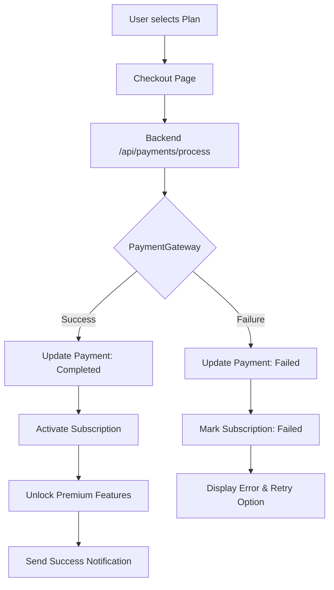

# Kenfinly Payment Module: System Architecture & Workflow

This document outlines the end-to-end architecture and workflow for the Kenfinly payment and subscription module.

## 1. High-Level Architecture
The system follows a service-oriented approach with a clear separation of concerns:
- **Frontend (React)**: Handles user interaction, plan selection, and checkout forms.
- **Backend (Laravel API)**: Manages business logic, gateway integration, and database state.
- **Payment Gateway (External)**: Handles secure card processing and transaction verification.
- **Database (PostgreSQL)**: Stores system state (Users, Plans, Subscriptions, Payments, Audit Logs).

---

## 2. End-to-End Workflow

### Phase 1: Selection & Checkout
1. **Plan Selection**: User views `SubscriptionPlan` options and selects one.
2. **Subscription Initialization**: System creates a `Subscription` record with status `pending`.
3. **Checkout**: User enters payment details on the Checkout Page.
4. **Processing**: Frontend sends payment data to `/api/payments/process`.

### Phase 2: Gateway Integration
1. **Credential Retrieval**: `PaymentProcessingService` fetches and decrypts `PaymentGatewayCredential` (AES-256).
2. **Transaction Start**: A `Payment` record is created with status `pending`.
3. **Gateway Call**: System securely transmits transaction data to the configured Payment Gateway (e.g., Stripe, PayPal).
4. **Response**: Gateway returns success or failure with a transaction ID.

---

## 3. Scenario Analysis

### Case A: Payment Successful ✅
**Flow:** Gateway confirms charge success.
- **Payment Record**: Updated to `status: completed`, `completed_at` set.
- **Subscription Record**: Updated to `status: active`, `start_date` and `end_date` set.
- **User Entitlements**: Premium features are unlocked (checked via `$user->subscription->isActive()`).
- **Audit Logging**: `PaymentGatewayAuditLog` records the successful transaction.
- **Notification**: System triggers a "Subscription Confirmed" email via SendGrid.

### Case B: Payment Failed ❌
**Flow:** Gateway returns an error (e.g., Insufficient Funds, Expired Card).
- **Payment Record**: Updated to `status: failed`, `failed_at` set, `failure_reason` recorded.
- **Subscription Record**: Updated to `status: failed`.
- **User Entitlements**: Premium features remain locked.
- **Notification**: UI displays a clear error message and offers a retry or alternative method.
- **Audit Logging**: Failure details are logged for admin review.

---

## 4. Entity Lifecycle Table

| Entity | Action on Success | Action on Failure |
| :--- | :--- | :--- |
| **Subscription** | `status` -> `active`, set dates | `status` -> `failed` |
| **Payment** | `status` -> `completed`, set `transaction_id` | `status` -> `failed`, log `failure_reason` |
| **User** | `is_premium` (or equivalent) logic becomes true | No change |
| **Audit Log** | Log `payment_success` | Log `payment_failure` with error context |
| **Transaction History** | Immutable record created | Immutable record created (marked failed) |

---

## 5. Visual Flow Diagram (Conceptual)

---

## 6. Security & Compliance
- **Data Masking**: Card numbers are never stored; only last 4 digits displayed in logs/UI.
- **Encryption**: Gateway API keys stored via AES-256-CBC.
- **Auditability**: All state transitions are recorded in `payment_gateway_audit_logs`.
